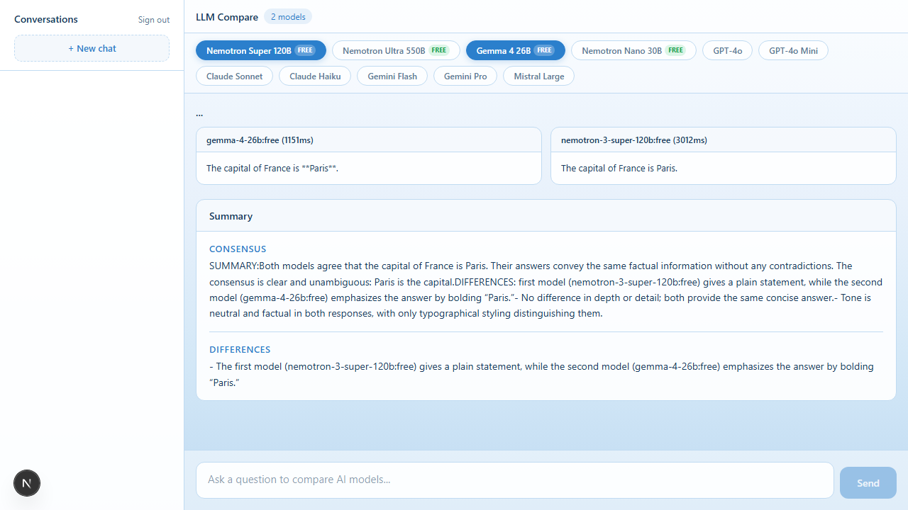

# LLM Compare Chat

Compare AI models side-by-side with streaming responses.



## What it does

Send one question to multiple LLM models at the same time, watch their responses stream in real-time, and get an AI summary that compares them.

## Features

- Multi-model comparison (up to 8 models)
- Real-time streaming responses
- AI-powered summary of differences
- Free models via OpenRouter
- Google and GitHub OAuth login
- Conversation history
- Markdown rendering in responses
- MCP Server integration

## Models

- DeepSeek V4 Flash
- Gemma 4 31B / 26B
- GPT-OSS 120B / 20B
- Llama 3.3 70B
- Nemotron Super 120B
- Laguna M.1

All free on OpenRouter.

## Tech Stack

- Next.js 16 + React 19
- Better Auth (Google + GitHub OAuth)
- Prisma + SQLite
- AI SDK + OpenRouter
- Tailwind CSS

## Setup

### Prerequisites

- Node.js 20+
- npm

### Install

```bash
npm install
```

### Environment

Copy `.env.example` to `.env` and fill in your credentials:

```bash
cp .env.example .env
```

You'll need:
- `OPENROUTER_API_KEY` from [openrouter.ai/keys](https://openrouter.ai/keys) (free)
- `BETTER_AUTH_SECRET` — run `npx auth@latest secret`
- Google OAuth creds from [Google Cloud Console](https://console.cloud.google.com/apis/credentials)
- GitHub OAuth creds from [GitHub Developer Settings](https://github.com/settings/developers)

### Database

```bash
npx prisma generate
npx prisma db push
```

### Run

```bash
npm run dev
```

Open http://localhost:3000

## OAuth Setup

### Google

1. Go to [Google Cloud Console > Credentials](https://console.cloud.google.com/apis/credentials)
2. Create OAuth 2.0 Client ID (Web application)
3. Add redirect URI: `http://localhost:3000/api/auth/callback/google`

### GitHub

1. Go to [GitHub > Settings > Developer settings > OAuth Apps](https://github.com/settings/developers)
2. Register new OAuth application
3. Set callback URL: `http://localhost:3000/api/auth/callback/github`

## Project Structure

```
src/
├── app/
│   ├── page.tsx           # Landing page
│   ├── chat/page.tsx      # Chat interface
│   └── api/
│       ├── auth/          # Better Auth
│       ├── chat/route.ts  # Multi-model fan-out + SSE
│       └── conversations/ # Conversation CRUD
├── components/
│   ├── login.tsx          # OAuth buttons
│   └── markdown-renderer.tsx
├── lib/
│   ├── auth.ts            # Auth config
│   ├── db.ts              # Prisma client
│   ├── llm.ts             # Model map + OpenRouter
│   └── store.ts           # DB operations
mcp-server/                # MCP server (optional)
prisma/schema.prisma       # Database schema
```

## MCP Server (optional)

If you want to use this with AI assistants:

```bash
cd mcp-server
npm install
npm run build
```

Add to your MCP client config:

```json
{
  "mcpServers": {
    "llm-compare": {
      "command": "node",
      "args": ["path/to/mcp-server/dist/index.js"],
      "env": {
        "OPENROUTER_API_KEY": "your-key"
      }
    }
  }
}
```

## Scripts

```bash
npm run dev       # Dev server
npm run build     # Production build
npm start         # Production server
npm run lint      # ESLint
```

## License

MIT
